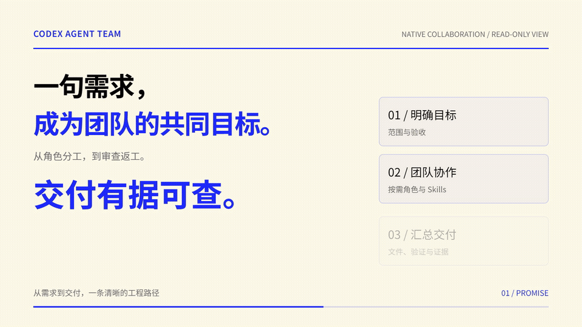
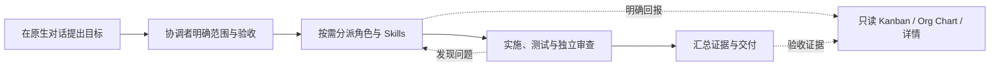

# Codex Agent Team

**让原生 Agent 成为可追踪、可协作、可验收的工程团队。**

从一句需求到角色分工、开发、审查和交付，在原生对话中完成协作，在独立网页中查看进度、已回报交互与证据。

宿主原生团队协作 · 按需 Skills · 独立网页 Kanban / Org Chart / 协作时间线 · 逐项验收 · Codex 插件 / 独立 Web

[产品视频](#产品视频) · [为什么选择](#为什么选择-codex-agent-team) · [团队如何工作](#团队如何工作) · [快速开始](#快速开始) · [接入其他客户端](#接入其他客户端) · [文档](#文档)

## 产品视频

[](videos/agent-team-promo/renders/agent-team-promo.mp4)

**[观看 / 下载完整视频](videos/agent-team-promo/renders/agent-team-promo.mp4)** · 45 秒 · 1080p · 中文静音动效

从一句需求，到专业角色协作、只读看板追踪和逐项证据交付。上方为 15 秒循环节选，点击查看完整 MP4。画面中的工单、角色活动与状态标注为“演示数据”，用于解释功能。

使用 HyperFrames 制作；[分镜与可编辑源码](videos/agent-team-promo/README.md)保留在仓库中。

## 为什么选择 Codex Agent Team

当一个工程任务需要需求分析、架构、开发与审查，难点不仅是让多个 Agent 开始工作，还包括明确职责、收集结果、协调返工，以及判断交付是否满足要求。

Codex Agent Team 将这些工程约定封装为 Skills，复用宿主原生子 Agent 能力，并将明确回报的任务、执行实例与证据同步到只读界面。

| 优势 | 对工程交付的帮助 |
| --- | --- |
| **原生协作** | 协调、派生、消息协作与执行沿用宿主原生工具，继续遵循宿主的权限与审批。 |
| **职责清晰，按需组队** | Coordinator、Requirements、Architect、Developer、Reviewer、UE 按任务参与，也可使用动态职责；角色 TOML 是可选配置。 |
| **Skills 按需使用** | 五个团队 Skills 覆盖准备、协作、同步、审查与 UI 设计，工程技能随实际任务读取。 |
| **进度一眼可见** | Kanban 查看工单和独立执行，Org Chart 查看已观察的原生关系或任务依赖，详情保留关联与历史。 |
| **交付有据可查** | 逐项 AC、文件证据、Agent 审查和适用的人工核验分别记录，执行结束与验收完成分别展示。 |
| **可移植的追踪协议** | 自包含同步脚本连接团队流程与展示；Codex 内嵌看板和独立 HTTP Web 复用同一快照。 |

## 团队如何工作



可以这样开始一个任务：

> 使用 Agent Team 为当前项目实现搜索功能。先明确范围与验收，再安排开发和独立审查，汇总修改文件、验证结果与待核验事项。

团队按任务选择角色。同一工作区保持一个写入者；需要并行写代码时，使用独立 worktree 和明确文件范围，最终串行集成。适用的规格、工单与视觉确认在原生对话中进行。

| 团队 Skill | 作用 |
| --- | --- |
| `setup-agent-team` | 显式准备目标工程，检查并安装缺失的团队技能依赖，保留已有文件。 |
| `agent-team` | 启用当前会话的团队流程，组织角色分工、协作与交付。 |
| `team-sync` | 回报工单、执行、活动与逐项证据，并核对同步结果。 |
| `team-review` | 独立审查、退回与复查；UI 工作还需对比确认图与真实运行效果。 |
| `team-ue` | 收集或生成 UI 方案，组织视觉确认并归档设计依据。 |

## 快速开始

需要支持插件及原生子 Agent 的 Codex、npm，以及兼容的 Node.js。本机验证使用 **Node.js 24**。当前插件版本 **0.5.0**，采用源码安装。

```powershell
git clone https://github.com/tohsaka888/codex-agent-team-plugin.git
cd codex-agent-team-plugin
npm ci
Push-Location plugins/agent-team
npm ci
node build.mjs
Pop-Location
```

可选旧 Codex 内嵌入口：将 `plugins/agent-team/.mcp.json.example` 复制为同目录 `.mcp.json`，把 `args` 中的 `server.mjs` 路径改成实际绝对路径；Node 不在宿主 PATH 中时，`command` 也使用绝对路径。已有配置先核对并保留。

```powershell
codex plugin marketplace add .
codex plugin add agent-team@codex-agent-team-plugin
codex plugin list --marketplace codex-agent-team-plugin --json
```

在**新会话**核对五个 Skills 和只读工具可见。首次准备目标工程时，显式调用 `$setup-agent-team`；日常在对话中提及 `@Agent Team`，或明确要求“使用 Agent Team 完成……”。已有会话更新后需重新读取技能指引，MCP 更新后需重连并重新打开看板。

可选角色预设安装、完整同步命令和接入检查见 [安装与接入](docs/getting-started.md)。

## 接入其他客户端

五个可移植 Skills 与独立 Web 可用于具备原生子 Agent 能力的其他客户端。各客户端的技能目录、技能发现和派生接口需实际核验。

源码构建可在任何目录执行 `node <插件绝对路径>/build.mjs --web-only`，构建阶段需要 esbuild；实际目标工程运行：

```powershell
node plugins/agent-team/install-skills.mjs --workspace D:/Projects/MyApp --target D:/Projects/MyApp/.agents/skills
node plugins/agent-team/dist/web/open-web.mjs --workspace D:/Projects/MyApp --team-id MyTeam
```

启动器核对 workspace/data-dir 后打开系统浏览器并返回团队 URL。独立分发包 `plugins/agent-team/dist/web` 可整体复制，只需 Node.js 20+，没有 MCP/Codex 运行依赖。`--no-open` 用于只启动和查询地址；端口占用用 `--port` 指定其他端口。安装目录应以目标客户端真实支持的目录为准；没有原生 Skills 发现机制时，明确要求读取已安装的 `agent-team/SKILL.md`。默认数据目录为目标工程的 `.agent-team`。

同步脚本自包含，不依赖插件缓存或 Codex SQLite。Claude Code、Hermes、DSH 等可使用通用接入路径；这些客户端的真实团队会话尚未全部验证。完整命令见 [安装与接入](docs/getting-started.md)，数据合同见 [可移植追踪](docs/portable-tracking.md)。

## 当前能力与边界

已有本机原生分派、按需技能协作、审查返工、通用同步 CLI、HTTP 页面与浏览器验证记录。不同版本的验证范围和结果保存在 [交接文档](docs/handoff.md)，历史证据不能代替当前宿主或其他客户端的实测。

- UI 负责查看、筛选、导航和展示；任务触发与执行在原生对话中完成。
- 展示范围来自已观察的原生活动及明确同步的记录；缺失信息标为未知或不可用，未回报的历史聊天不会自动补齐。
- 执行完成、Agent 审查和适用的人工验收独立记录；安装 Skills 或角色配置不等于流程已经运行。
- 暂不提供独立模型执行器、后台调度服务，或关闭宿主 App 后继续运行的保证。完整宿主断线恢复与其他客户端真实会话仍需核验。

## 文档

| 你想了解 | 从这里开始 |
| --- | --- |
| 安装、角色预设、同步示例 | [安装与接入](docs/getting-started.md) |
| 原生协作与只读展示的职责 | [架构](docs/architecture.md) · [团队使用合同](docs/native-team.md) |
| 阶段范围与验收 | [第一阶段](docs/phase1.md) · [第二阶段](docs/phase2.md) |
| 追踪与证据数据 | [可移植追踪](docs/portable-tracking.md) · [展示数据合同](docs/ui-data-contract.md) |
| 人工评审与结果核验 | [人工评审](docs/human-review.md) · [验收合同 v2](docs/acceptance-contract-v2.md) |
| 工程协作与设计依据 | [AGENTS.md](AGENTS.md) · [领域词汇](GLOSSARY.md) · [design.md](design.md) |
| 技能来源与本地工单 | [Skills 说明](docs/agents/skills.md) · [工单约定](docs/agents/issue-tracker.md) |
| 当前进展与后续工作 | [交接](docs/handoff.md) · [README 历史快照](docs/history/readme-before-product-promo.md) |

`.scratch/` 保存本机临时评审与验证记录，不随仓库发布。新克隆请以正式 `docs/` 文档为入口。

## 开发与验证

```powershell
npm ci
npm run lint
npm run format:check
npm run design:lint
node --test plugins/agent-team/*.test.mjs
Push-Location plugins/agent-team
node build.mjs
Pop-Location
```

`design:lint` 用于设计规范相关工作；行为修改应按实际风险选择检查。纯页面预览可在插件目录运行 `node server.mjs --http`，未接入活动时显示空态。

第三方工程 Skills 的来源、固定版本与许可见 [Skills 说明](docs/agents/skills.md)。README 的信息组织参考 [AionUi](https://github.com/iofficeai/aionui)，产品能力与验证边界以本仓库文档为准。

协作时间线按任务、发送/接收Agent及类型筛选，支持纯文本正文、回复定位和新交互查看。声明/观测时间与归档时间分别展示；未知关联保持未知，未采集历史不自动补齐。网页只查看，派生和发送仍使用宿主原生工具。
