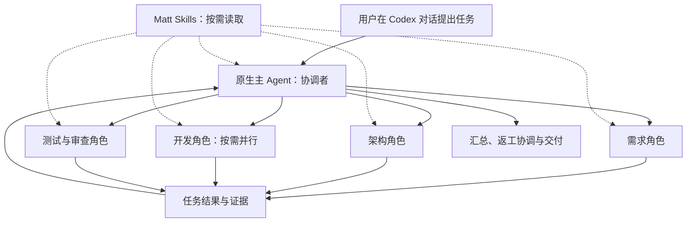
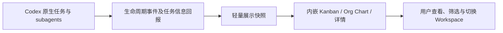

# 当前架构：原生团队与只读展示

当前入口（2026-10-02）：用户提及 `@Agent Team` 在当前主会话启用原生团队技能；后续需求沿用，直到退出。只读 Kanban / Org Chart 按真实主会话及其全部已观察子 Agent 展示，Workspace 作为项目筛选上下文。插件 ID 为 `agent-team`；只读工具名保留兼容。入口已打包，宿主新会话的自动匹配仍须区分于代码检查通过。
日期：2026-10-01。当前范围由用户明确确定；角色数量、模型分配和具体装载配置仍以阶段一规格及后续实施为准。

## 第一阶段：原生 Agent Team

协调者使用 Codex 原生工具分派、补充任务、等待结果和组织返工。角色预设定义职责、输入输出和适用 Skills，执行 Profile 定义模型、推理强度及受宿主约束的工具/权限配置。
团队角色按需启动，不要求每次全员出场。具体需求和验收只在原生对话及工程文档中确认；本项目不另设产品审批引擎。

角色职责可以通过原生委派指令表达，也可以使用官方支持的可选自定义 Agent 配置。Skills 由 Codex 从有效技能目录发现，Agent 根据任务按需读取正文与引用；子 Agent 未覆盖时继承父会话的 Skills 配置。内置/系统、用户、项目和插件技能按宿主提供的可用范围使用，不由 UI 插件另建装载器。
Skills 目录可被发现、技能正文被读取、流程真正执行分别验证。只写角色指令或声称使用某技能不构成运行证据；真实委派和具体技能应用可以证明协作，不要求自定义角色名选择接口。

## 后续阶段：内嵌只读 UI

UI 只改变自身视图。团队触发和执行由原生 Codex 对话承担。数据采集不调度任务、不阻断执行；展示快照不是持久任务数据库。
详情将明确回报的验收项、Agent/人工评审与文件证据分别展示。执行记录链接指向已观察的本机原生实例；文件预览经 app-only 只读工具核对会话、任务关联及工作区真实路径边界。该读取链路不启动模型或执行任务，原生编辑器直达仍受宿主接口限制。
Org Chart 以真实父子标识为依据，按同一父组织分支的明确职责汇总执行实例，仅展示最近任务；实例与历史任务保留在详情。Kanban 使用真实任务关联及实际状态。职责、原生 agent_type、派生 task_name 和执行 Profile 分别保存；任务语义由协调者回报，不能把线程名称或进程退出直接当成验收状态。
“待评审”如保留，仅展示对话中的工作阶段；没有在 UI 批准或退回的控制。
先显示接入本团队流程的实际数据，不承诺无配置回填全部历史聊天。SSH 执行环境的事件回报和展示归属需要后续实际集成。

## 当前范围

第一阶段交付原生团队角色预设、Skills 装载规则和真实协作验收；第二阶段完善轻量采集与只读内嵌展示。
暂不包含独立模型执行器、SSH 执行器、独立调度服务、持久任务数据库、严格审批门槛或关闭 App 后继续执行。Codex 自身权限控制继续生效。

## 工程协作与证据

每次分派说明任务、输入、写入范围、验收条件与结果位置。只读研究可并行；写入者按工作区隔离，共享变更串行集成。
任务至少区分待开始、进行中、待评审、执行完成及失败/阻塞；执行完成不等于已验收或发布。
首版用规格、工单、结果文件及真实执行记录作为工程证据，不建设业务持久化引擎。
详细步骤见 [第一阶段](phase1.md) 和 [规格](../.scratch/native-agent-team/spec.md)；只读展示见 [第二阶段](phase2.md) 与 [数据合同](ui-data-contract.md)。

## 能力状态

- 官方支持原生 subagents、角色定制和 Skills；本仓库五份可选预设已创建；原生职责分派与按需技能协作已验证，自定义角色配置层不是阶段一必需验收。使用约定见 [团队合同](native-team.md)。
- 已实测侧栏入口、内嵌握手及 Workspace 页面链路。
- 本次本机原生团队 Hook、父子关系与明确任务回报已进入安装插件并实测；仅代表接入该流程的活动。SSH 实时事件及完整宿主断线恢复尚未完成验收。
- `docs/research/` 保存原始历史证据，不能将独立 App Server 会话当成宿主原生团队。
- 被取代的架构完整保存于 [历史架构](history/architecture-before-native-team.md)。

官方参考：[Subagents](https://learn.chatgpt.com/docs/agent-configuration/subagents)、[Build skills](https://learn.chatgpt.com/docs/build-skills)、[Hooks](https://learn.chatgpt.com/docs/hooks)、[插件扩展](https://developers.openai.com/plugins/build/extensions)。
