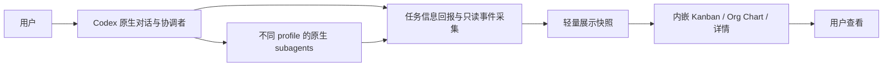
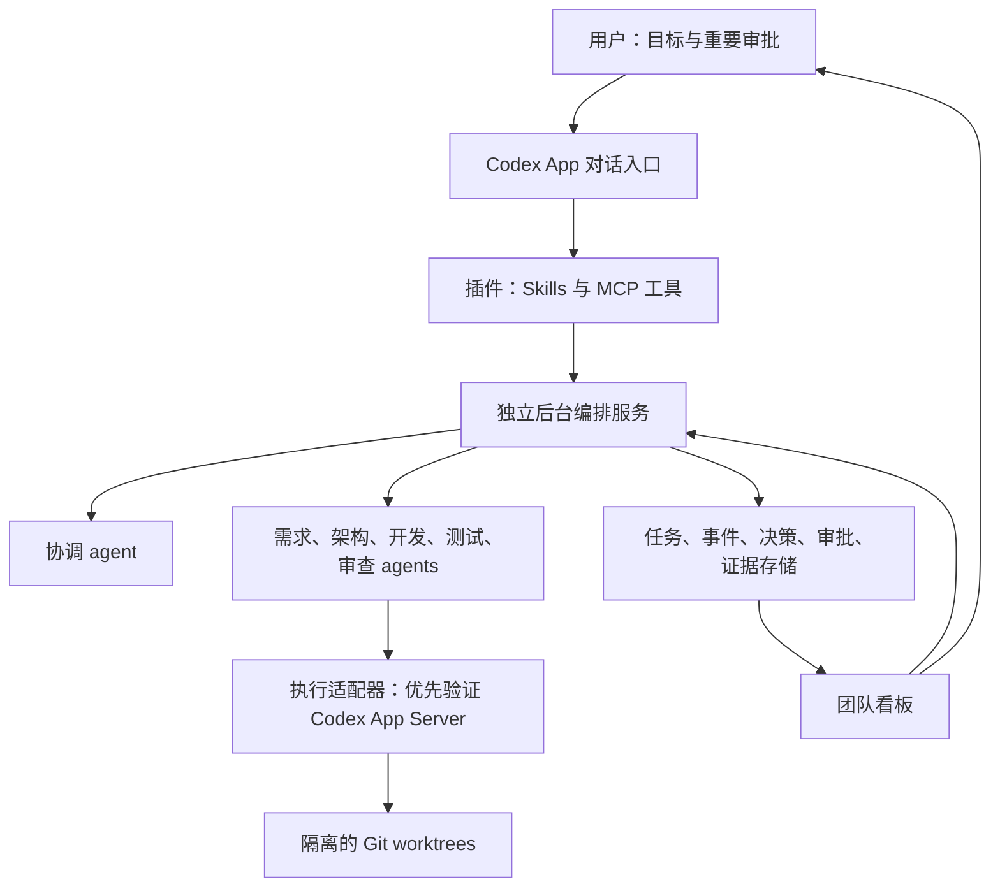

# 历史档案：已被当前方向取代

本文件仅保留历史内容，不作为当前实施指令。当前架构见 [architecture.md](../architecture.md)，第一阶段见 [phase1.md](../phase1.md)。

# Codex Agent Team 架构与实施交接

整理日期：2026-10-01。工作区：`D:\Workspaces\codex-agent-team`。

## 最新职责边界（优先于下文历史建议）

最新用户范围调整：UI 完全只读，仅查看当前 agent team 的 Kanban、Org Chart、详情和 Workspace。团队创建、任务触发、协作与执行均在 Codex 原生对话中进行。暂时去掉持久任务数据库、严格审批门槛和关闭 App 后继续运行要求；UI 不提供启动、暂停、恢复、批准或取消原生任务的操作。原先的评审状态如保留，仅展示对话中报告的状态，不在 UI 建立审批门槛。

当前方案的数据流（实施建议，不表示原生事件链路已完成实测）：

Org Chart 由真实父子 agent 标识构建；Kanban 的任务标题、任务关联和评审状态由协调者回报，执行状态由实际事件更新。采集不阻断或改变原生执行。SSH 工作区需要其执行环境也能回报事件，不能仅凭已保存项目清单宣称实时追踪已实现。

用户明确要求插件增强 Codex 的团队 UI，任务执行、subagent 创建与协作、SSH 工作区执行均由 Codex 原生能力承担。插件负责 Workspace Kanban、Agent Org Chart、详情、刷新和人工评审记录；可以提供轻量状态存储与桥接，但不另建模型执行器、SSH 执行器或独立调度引擎。

原生能力存在与第三方插件可访问该能力分别判断。当前侧栏入口和宿主 UI 已有证据；自动读取宿主全部原生任务、实时 subagent 关系及远程状态没有完整端到端证据。后续规划必须标明状态来源、可见范围和更新方式，不能以独立 App Server 的事件替代原生宿主事件。

下文独立后台编排、执行适配器及其阶段 0 路线仅保留为历史建议，未获用户采用，不作为当前实施要求。远程独立执行探针的 401 不构成原生远程任务的实施前提；不再重复该路线的 POC。

本文保存前序会话的产品目标和建议架构，供新会话继续实现。当前已有本地 MCP/UI 可运行探针；完整编排服务与产品尚未实现。最新能力证据见 `docs/research/verification-results.md`。除明确标记为用户要求的内容外，技术选择均为待验证的建议。

## 以下为历史架构，已被上述只读范围取代

## 1. 历史用户要求

构建一个接入 Codex App 的插件，托管多 agent 软件工程团队：

- 根据任务分配角色、模型与执行 profile。
- agents 先协作细化需求、比较架构和讨论取舍，再组织开发。
- 用户只审批重要决定，其他事项在既定授权范围内自主完成。
- 支持长期后台任务，持久保存进度并恢复工作。
- 展示各角色的执行状态、讨论、阻塞项和交付证据。
- 遵循软件工程思想，参考 `mattpocock/skills` 的领域建模、ADR、任务拆分、TDD 和审查实践。
- 本项目使用独立 Git 仓库管理，所有用户沟通使用中文。

前序会话要求保存架构并交接。2026-10-01 的当前会话已授权前期配置、安装 Matt skills 和生成 UE 效果图；应用实现和第三方应用框架仍未启动。

## 2. 能力边界与术语

插件是入口和能力封装；长期运行需要独立的执行与调度服务。不能把聊天上下文当成唯一任务数据库。

| 术语 | 项目中的含义 |
| --- | --- |
| Role | 职责、指令、输入输出要求，例如架构师或审查员 |
| Profile | 执行配置：适配器、模型、推理强度、权限、工具、并发和预算策略 |
| Agent run | 某个角色在具体任务上的一次执行，有独立状态和证据 |
| Coordinator | 组织讨论、制定计划并协调执行的 agent |
| Orchestrator | 执行依赖、审批和调度规则的服务，不等同于协调 agent |
| Task | 有验收标准和依赖关系的工作项 |
| Decision | 具有方案、依据、影响和审批策略的决定 |
| Delivery | 代码、测试结果、审查报告、预览或发布材料组成的交付 |

Profile 默认指角色和执行配置，不代表多个登录账号自动轮换。多账号托管、跨供应商执行和 API 付费路径都不属于首版已确定范围。

## 3. 总体架构

独立后台服务拥有运行状态。插件和看板是两个访问入口；关闭看板或断开插件连接不应主动销毁后台任务。关闭 Codex App 后能否继续实际执行，必须验证适配器的进程、登录和会话生命周期。

### 3.1 插件层

- 封装可复用的工程协调 skills 和 MCP 服务配置。
- 支持创建目标、查看团队、获取审批、暂停、恢复和取消任务。
- 返回精简的状态、证据和下一步；避免向协调聊天重复回放完整日志。
- 插件清单、安装目录、hooks 和本地 marketplace 格式以实现时官方文档及当前版本为准。
- 自定义 UI 优先验证 MCP Apps；如果 Codex App 无法渲染，先使用工具响应及可在 App 浏览器面板中打开的本地看板。
- 不假设插件能修改原生侧栏、注册任意常驻面板或自动生成原生聊天。

### 3.2 编排服务

- 持久保存目标、任务图、讨论、决定、运行和证据。
- 按任务类型及已批准的 profile 池选择执行者。
- 执行任务依赖、并发上限、工作区占用、审批和预算规则。
- 管理后台进程、超时、心跳、失败重试和恢复。
- 监听事件后推进工作；避免不断唤醒大上下文协调者来轮询。
- 将模型输出作为提议，由确定性的规则检查状态转换、权限和依赖。

### 3.3 执行适配器

优先评估官方 Codex App Server，保留适配器接口，以便必要时采用非交互 CLI。

需要提供启动、观察、继续、取消、收集输出和处理执行权限请求的能力。上述是项目接口要求，不是已确认的 App Server API 方法名。

插件当前会话与服务自行创建的执行会话分别管理。不能假设二者共享全部上下文、工具、登录状态或 UI 可见性。

### 3.4 数据与看板

首版建议使用 SQLite 保存事务状态和事件，文件系统保存日志及较大证据。该选型尚未由用户审批。

看板至少包含：团队状态、任务图、当前步骤、角色与 profile、讨论摘要与原文、待审批项、修改文件、测试证据、审查结果和交付记录。用量只有在执行方提供真实计量时显示，否则标记不可用。

## 4. 角色与讨论机制

首版建议采用少量职责明确的角色，按需启动，避免每次都运行全部角色。

| 角色 | 主要职责 | 交付物 |
| --- | --- | --- |
| 协调者 | 整理目标、维护计划、分派工作、汇总分歧 | 任务图、检查点、交付摘要 |
| 需求分析者 | 识别业务规则、假设、边界和验收条件 | 规格、待澄清问题 |
| 架构师 | 对比方案、定义模块接口和实施顺序 | 架构方案、ADR |
| 开发者 | 在指定范围内实现任务 | 代码与验证结果 |
| 测试与审查者 | 独立检验行为、风险和需求覆盖 | 审查发现、验收证据 |

讨论流程建议为：提出方案 → 独立批评 → 修订 → 汇总决定。每次讨论有问题、输出合同、轮数及资源上限。达到上限后，协调者提交已有证据与分歧，按策略决定继续研究或请求用户判断。

Agent 消息必须记录发送者、接收者、关联任务和时间。内部讨论不能自动触发向真实用户以外的外部联系人发送消息。

agents 达成共识不代表正确；通过测试、实际运行和独立审查才能确认交付。

## 5. 重要决定与审批

用户期望少审批，首版需要把这一目标落实为可执行策略，而不是仅写进 prompt。

| 默认建议 | 事项 |
| --- | --- |
| 自主推进 | 已批准范围内的拆分、实现、测试、修复、审查和可逆技术调整 |
| 提交用户 | 产品范围变化、关键业务假设、重大架构取舍、超出预算、生产发布和不可逆操作 |

审批请求包含：问题、候选方案、推荐方案、依据、影响、可逆性和不决定的后果。低风险选择可记入决策记录后继续工作；重大选择未获回答时只阻塞依赖该选择的任务。

具体阈值、初始预算、允许模型和发布授权尚待确认。工程产品审批与执行工具的权限审批分别处理；插件不能绕过 Codex 的沙箱、权限及自动审批审查。

审批应绑定具体方案版本，方案实质变化后旧审批不可继续使用。沉默和超时不视为批准。

## 6. 工作流与状态

建议工作流：目标 → 需求与领域模型 → 架构与 ADR → 审批关键决定 → 任务图 → 实施 → 测试与审查 → 修复 → 集成 → 交付。

任务建议状态：`queued`、`ready`、`running`、`waiting_approval`、`blocked`、`awaiting_review`、`repair_required`、`completed`、`failed`、`cancelled`。

- 执行进程退出成功，先进入 `awaiting_review`。
- 测试和审查证据满足验收条件后，才能进入 `completed`。
- 依赖任务完成且审批满足要求，后继任务才可进入 `ready`。
- 重试有次数和预算上限，不能无限递归生成修复任务。
- 系统明确区分“已执行”“已验收”“已集成”和“已发布”。

## 7. 持久化与恢复

最少实体：Project、Goal、Task、Role、Profile、AgentRun、Message、Decision、Approval、Artifact、Event、Checkpoint。

每条执行记录保存任务输入版本、profile 快照、工作区、基线提交、会话标识、进程状态、输出和证据引用。

后台任务采用持久队列、运行租约或等价占用机制、心跳及检查点。重启时检查执行会话是否仍存在，不能仅凭数据库的 `running` 字段判定任务健康。

调度和事件消费允许重复到达，但任务启动、审批应用及 Git 集成必须防止重复副作用。恢复时核对工作区实际状态，不盲目重放命令。恢复失败应报告可操作的阻塞原因。

检查点保存目标、已完成项、待决定事项、证据位置、下一步和当前代码状态，不只保存聊天摘要。

## 8. Git 与交付

- Git-backed 项目默认每个并行写入者使用独立 worktree 和分支。
- 同一工作区同时只有一个写入者；共享文件变化经协调者串行集成。
- 任务依赖不只是文本说明，还应约束调度。
- 审查者查看实际 diff 并执行相关验证，不只相信开发者报告。
- 集成完成后再对最终代码运行必要验证，防止单个分支通过但组合后失败。
- 清理仅针对系统创建且确认归属的资源，保留决策、审查和交付历史。
- 默认交付至可审查的代码与材料。自动合并、远程推送及生产发布是否授权，需要分别配置。

## 9. Matt Pocock skills 的接入

采用其工程思想，避免同时叠加多个相互竞争的流程框架。

重点参考：领域术语表、ADR、具有明确验收和依赖的任务、纵向小步实现、TDD、诊断反馈循环、深模块设计、独立代码审查。

前序调研看到的相关 skills 包括 `grill-with-docs`、`to-spec`、`to-tickets`、`implement-spec`、`tdd`、`diagnosing-bugs`、`domain-modeling` 和 `codebase-design`。仓库会变化，实施前应确认具体版本、内容、许可和安装方式。

原仓库区分用户主动调用与模型可调用 skills。无人值守编排需要显式适配这一边界；不能声称原版所有流程安装后即可自动执行，也不能让 agents 编造只有用户才能提供的业务事实。

首版建议固定上游版本，记录采用哪些原始文件及哪些本地适配，不自动跟随上游更新。

当前已安装 engineering / productivity / misc 共 31 个项目级 skills，固定提交 `d81f3a183412e71a5b1e84ca21bc1a35eea03a60`，排除 in-progress。来源、许可、清单和适配边界见 `docs/agents/skills.md`。这是技能文件安装，不是执行层或无人值守编排的完成证明。

## 10. 实施阶段与验收

### 阶段 0：能力验证

1. 检查本机 Codex 版本、可用模型、登录及 App Server 能力。
2. 创建最小本地插件，验证 MCP 工具能从 Codex 对话调用。
3. 验证工具能启动一个独立执行会话，采集事件，继续或取消执行。
4. 验证 App 内自定义 UI；不支持时验证本地看板打开路径。
5. 实测客户端断开与服务重启后的会话状态。

输出能力矩阵与证据，记录哪些能力可用、受限或不可用。这一阶段不启动大规模自动开发。

### 阶段 1：最小闭环

实现单项目、少量角色、Codex 单一执行适配器、持久任务图、一次关键审批、隔离实施、独立审查和基础看板。

验收场景：给出一个小型 app 目标 → 需求与架构角色产出文档 → 用户批准关键选择 → 自动实施 → 测试审查 → 修复 → 交付代码和证据。

必须能观察角色活动、查看审批对应的方案、暂停任务，并在服务重启后恢复或明确报告无法恢复；不得重复执行已完成的外部副作用。

### 阶段 2：长期任务

完善租约、检查点、事件驱动唤醒、限次重试、预算和通知。验证耗时任务及断线恢复，同时测试额度不足、进程退出、冲突和超时。

### 阶段 3：扩展

在闭环可靠后，再考虑多项目、复杂 profile 路由、其他执行工具、服务器部署和更深的 UI 集成。

## 11. 技术建议与待定事项

建议起点为 TypeScript、官方 MCP SDK、SQLite 和 Web 看板，但未固定框架、依赖版本和打包方式。Windows 为当前开发环境；先验证原生执行，只有确有需要时再采用 WSL。

待定事项：

- 插件内嵌 UI 的实际支持程度及 fallback。
- App Server 身份与客户端退出后的运行生命周期。
- 后台服务是否需要 Windows 开机启动，或迁移至常开服务器。
- 角色模型池、并发、预算、审批阈值。
- 原生子 agents 与服务管理的独立会话如何分工。
- Matt skills 的具体版本、适配及用户调用边界。
- GitHub/其他 issue tracker 和远程交付的范围。

## 12. 参考与调研结论

以下链接是前序调研的入口，非实现能力的实测证明。未来实现时重新核对官方说明与当前版本。

- [插件打包与本地分发](https://developers.openai.com/plugins/build/plugins)
- [插件架构](https://developers.openai.com/plugins/concepts/plugins)
- [MCP UI](https://developers.openai.com/plugins/build/chatgpt-ui)
- [Codex App Server](https://learn.chatgpt.com/docs/app-server)
- [原生 Subagents 与自定义角色](https://learn.chatgpt.com/docs/agent-configuration/subagents)
- [长期任务](https://learn.chatgpt.com/docs/long-running-work)
- [定时任务](https://learn.chatgpt.com/docs/automations)
- [Matt Pocock skills](https://github.com/mattpocock/skills)
- [Augani agent-orchestrator](https://github.com/Augani/agent-orchestrator)：参考持久任务、独立执行和审查看板。
- [Oh My Codex](https://github.com/Yeachan-Heo/oh-my-codex)：参考共识规划、检查点和团队运行。
- [Agent Orchestrator](https://github.com/Untrivial-ai/agent-orchestrator)：参考隔离 worker 与项目看板。
- [Superpowers](https://github.com/obra/superpowers)：参考工程计划、子 agent 开发和审查。

前序会话未安装以上第三方插件或框架，没有验证其 Windows 可用性，也没有承诺复用其代码。
